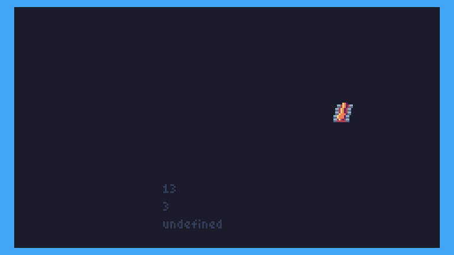
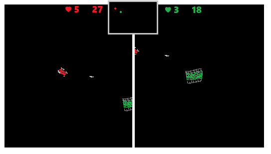
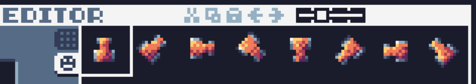

# Diary

2021-02-01

- Thinking about vehicles. The 16x16 sprites take quite some space. 4 8x8 blocks per sprite. I got 8 per car, but I don't think it's enough for reasonably smooth animation.
- I added an 8x8 car with 16 steps of rotations. That's half as much space as the other, and smoother movement. 8x8 should be enough, since you were just a pixel in the original game :p
- Also trying with just 4 16x16 sprites = a quarter rotation, and solve the rest by rotating the sprite and swapping palette colors.


_The color-changing tank at the start of the animation, is only 4 16x16 sprites._


2021-01-29

- Played a bit with the palette. 'C' toggles color scheme for the car. Greys for the weels are updated with the tic.
- 'V' toggles vehicle type.

2021-01-29

- Made a start on writing some game logic. The game itself is supposed to be a really simple death match game. Labeled 'Drive', you'd be an ever moving player. The players had a mostly constant speed, and a certain steer (the position of their steering wheel as it were). So instead of moving to the left or to the right, you could rotate your steering wheel a bit, indirectly influencing how you're going to move from that moment on.
- Originally written in QBasic, the game field was 320x200, and would wrap around. The players (and bullets) were just single pixels. The TIC-80 has a lower resolution, and I do want to use sprites for players, so if I don't introduce a scrolling field, the map is going to be too cramped to play, I think. I'll have to test and see.
- But probably, there is going to be a split-screen view, on a larger map.
- Since the game requires only 3 keys per player, the original game featured controls for up to 7 players on a single keyboard, although more than 4 was not really practical. It would fit, I think 20 or 24 players in total. The rest played by 'AI'. By this time, I had rewritten it in C, by the way, since QBasic's input abstraction didn't handle the state of so many keys. I needed to go a bit more low level for that. In practise, the hardware (at the time at least), seemed to support only 8 key states as well, but for 4 players that worked quite okay.
- So, this game is going to have scrolling, and a split screen view. Up to 4 players should be enough, so for 2, it can be split into a left and right pane. For 3 or 4 players, it can be in 4 views, with the 4th maybe to show random CPU players, if there are only 3 human players. Maybe a shared radar can be shown in the center top for 2 players, center mid for 4.


_sketch of how it_ could _look, when two players get near each other in split screen._

- Other ways to up this game compared to the original:
  - More interesting background for map.
  - Actual surface difference, inaccessible areas, or areas that affect speed (mud, water)
  - Different effect on different vehicles.
  - AI players that are smart in how they predict your position, trying to intercept you if you go around an inaccessible area.

Anyway, not there by far. :D

----

2021-01-28

- This auto-refresh is nice. Hitting F5 will start TIC with the game loaded, and tsc-80 monitoring file changes and compiling on the fly. The workflow of typing code, checking the feedback from VS Code ([Typescript@next extension](https://marketplace.visualstudio.com/items?itemName=ms-vscode.vscode-typescript-next)).
- When it compiles, I can just alt+tab to TIC-80, and hit Ctrl+R to reload the code. This is a quite workable workflow!
- Drew some sprites for a 'tank'.



----

2021-01-27

- Managed to build TIC80 1.0 dev in PRO mode.
  - Didn't have VS 2017, and couldn't get it to work with VS 2019.
  - I did manage to build it with mingw, but couldn't find how to pass the 'PRO' build option on the command line.
  - I set `BUILD_PRO` to `TRUE` in `CMakeList.txt`, and that did the trick.
- Found out that I somehow have been mixing versions of TIC80-typescript.
  - My cartridge file is useless, as was a part of the config.
  - This version seems to always load `game.js`, which is expected to be a PRO cartridge, containing at least the sprites, etc.
  - It then loads `compressed.js`, which seems to replace the loaded code. *)
  - When you save the cartridge, it is saved to `game.js`, which contains then the updated sprites. It also contains the code, which is a bit redundant for version control purposes, but it is how it is. It's tempting to make changes to the code in the TIC environment, but those should be made in `index.ts`.

*) Confirmed, it runs:

```
TIC80 
  --skip            # skip intro animation for faster testing
  --keepcmd         # re-run cmd on every reload 
  --fs={projectdir} # set file system/working dir
  --cmd             # commands to run
       load game.js               # load entire cartridge
       & load compressed.js code  # load only the code
       & run                      
    
```

- Current modus operandi:
  - Can run with F1, which runs `tsc80 run`. This launches my self-built TIC80-dev-PRO, loads the game, and loads the new compiled code.
  - Changes to the code are automatically recompiled. Reloading the game with `ctrl+r` to see the changes immediately.
  - Looks like I may actually write some Typescript next time ...

----
2021-01-26

- Created a default TIC80 cartridge file.
- Fetched and installed [tic80-typescript](https://github.com/scambier/tic80-typescript), which should allow me to write typescript, and embed it as JavaScript in my TIC80 'cartridge' file.
- Installed the [F5 Anything extension for VS Code](https://marketplace.visualstudio.com/items?itemName=discretegames.f5anything)
- Made a launch config to compile and run config with F5.
